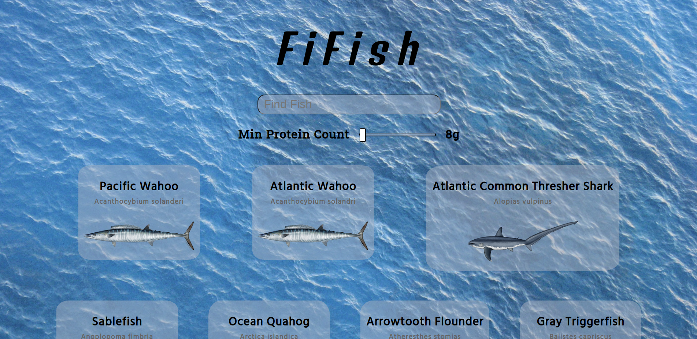
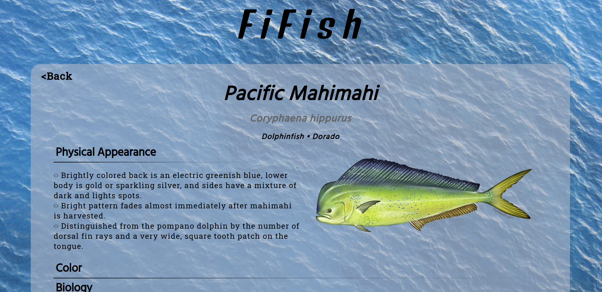

# FiFish
**FiFish** is probably my dearest personal project, because it is also my first (more serious) one. It is purely a frontend website, made using the public <a href="https://www.fishwatch.gov/">FishWatch.gov</a> API. The concept is very simple: just search for a fish (or seafood) and you will see lots of interesting facts about the species, such as appearance, biology and a surprising collection of pictures.

